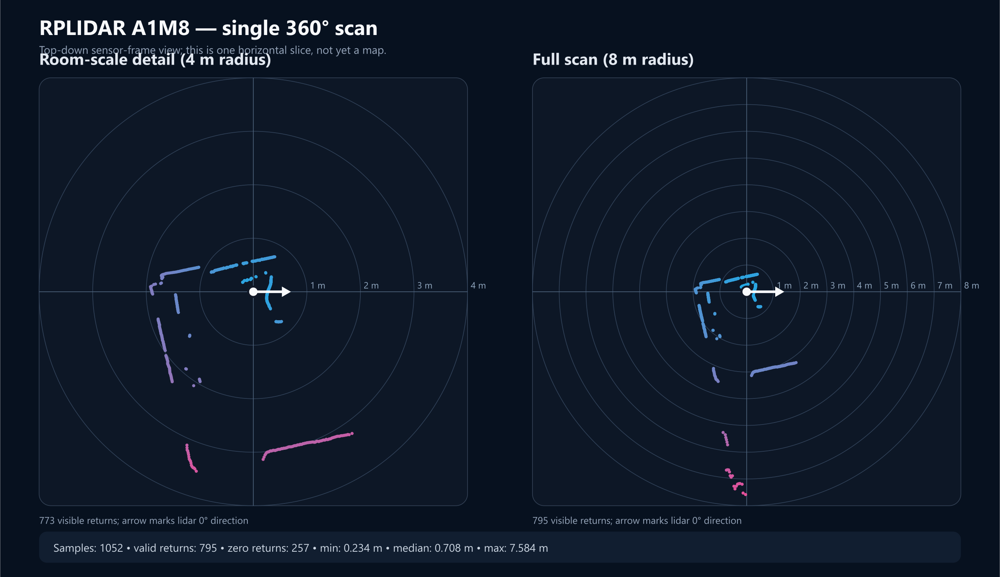

# Milestone 0 Visual Results

## Camera

The Camera Module 2 produced a valid 3280x2464 still and completed a ten-minute
1920x1080, 15 fps load recording. The still was geometrically coherent and free
of cable corruption. Better lighting and more textured surfaces will improve
future visual reconstruction.

## Lidar

The A1M8 returned a complete 360-degree horizontal scan:



Scan summary:

- 1,052 angular samples;
- 795 valid, nonzero returns;
- 257 zero/no-return samples;
- minimum valid range: 0.234 m;
- median valid range: 0.708 m;
- maximum valid range: 7.584 m.

The close arc around the sensor is likely nearby furniture, rig components, or
the table edge. The longer returns represent more distant room boundaries or
returns through/near the window. This single scan is a sensor-frame snapshot,
not a SLAM map and not a 3D reconstruction.

Regenerate the visualization with:

```powershell
python reconstruction/tools/plot_lidar_scan.py `
  C:\Users\Neel\Downloads\lidar-scan.txt `
  docs\assets\milestone0-lidar-scan.svg
```
