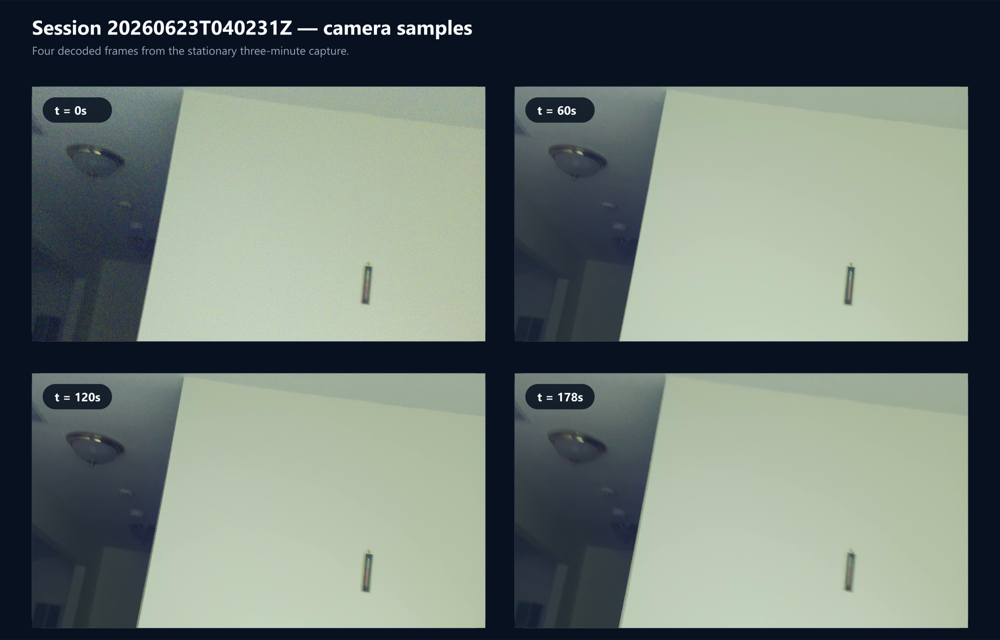
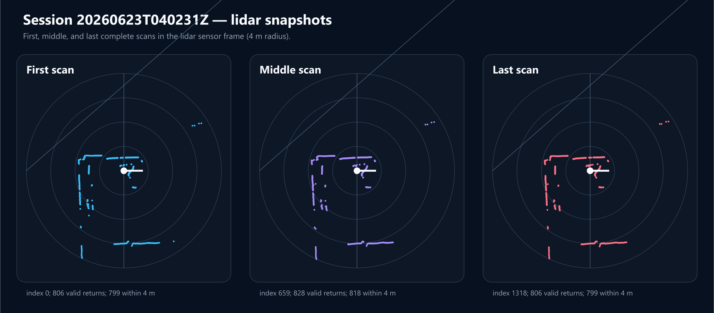
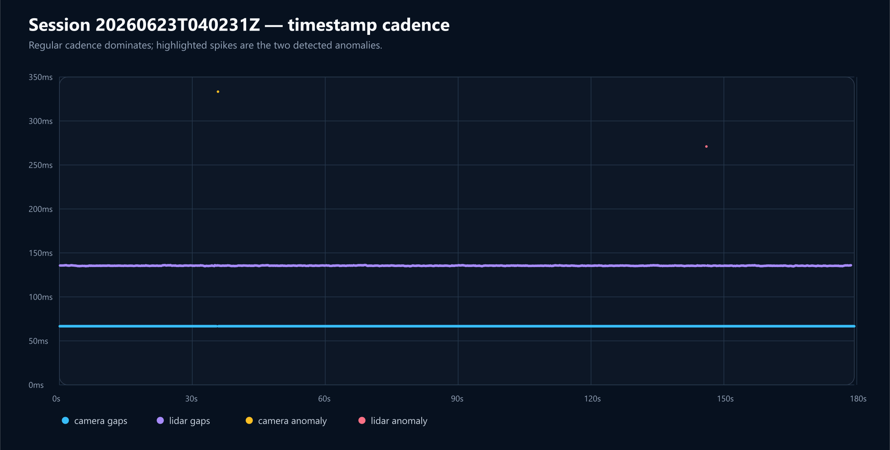

# Three-minute Stationary Session Results

Session: `20260623T040231Z`

This capture validates the recording and timestamp pipeline. Because the
sensors were not rigidly mounted, it is not valid input for reconstruction.

## Camera



The camera produced 2,689 frames over 179.434 seconds. A locally remuxed,
easier-to-open copy is available at:

```text
C:\Users\Neel\Downloads\20260623T040231Z\camera-preview.mp4
```

The camera remained stable, but it was aimed mostly at a low-texture ceiling
and wall. That is sufficient for this stationary recorder test but unsuitable
for future visual tracking.

## Lidar



The lidar produced 1,319 complete scans. Similar first, middle, and final scans
are expected because the sensors and room remained stationary.

## Timestamp Cadence



Most camera gaps are approximately 66.65 ms and most lidar scan gaps are
approximately 135.5 ms. One camera gap and one delayed/combined lidar scan are
visible as isolated spikes.
